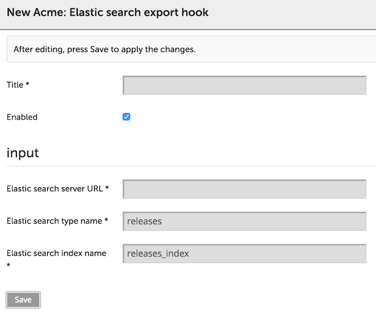

This sample is intended to show how to develop custom export hooks for completed releases. It has been tested with Elastic Search 1.5.2 with standard settings.

Requirements: XL Release 4.7.0+.

There are 2 ways to load this export hook into XL Release:

## As a jar

1. From the root folder do: `./gradlew clean :elastic-search-export-hook:jar`;
2. Copy generated jar (`./elastic-search-export-hook/build/libs/elastic-search-export-hook-*.jar`) into `XLRELEASE_SERVER_HOME/plugins`;
3. Restart the server.

## Add files to the the classpath

1. Copy contents of `elastic-search-export-hook/src/main/resources` into `XLRELEASE_SERVER_HOME/ext`;
2. Restart the server.

After doing so you can go to `Settings -> Configuration` in XL Release and choose newly appeared option `Add Elastic search export hook`.

Default values should be fine if you are running elastic search locally. After the release is completed and archived, it should be visible at the results of: `curl 'http://localhost:9200/releases/_search'`

## Tips and tricks

* Enable frequent archivation to test the script easier. You can do that by setting `xlrelease.ArchivingSettings.archivingJobCronSchedule=*/10 * * * * *` at `conf/deployit-defaults.properties` and selecting '0 Days' at `Settings -> General settings`;
* You don't need to restart the server if you change main python script;
* You do need to restart the server if you change `synthetic.xml`

## Related articles

* <a href="https://docs.xebialabs.com/xl-deploy/how-to/writing-jython-scripts-for-xl-deploy.html">Writing Jython scripts for XL Deploy</a>
