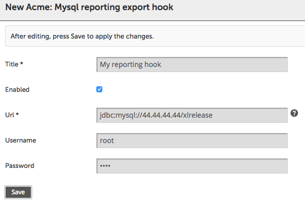

This sample is intended to show how to develop custom JDBC export hook which takes completed releases, extracts some data and puts it into a 3rd-party database. It has been tested with MySQL 5.6.

Requirements: XL Release 4.7.0+.

There are 2 ways to load this export hook into XL Release:

## As a jar

1. From the root folder do: `./gradlew clean :mysql-jdbc-export-hook:jar`;
2. Copy generated jar (`./mysql-jdbc-export-hook/build/libs/mysql-jdbc-export-hook-*.jar`) into `XLRELEASE_SERVER_HOME/plugins`;
3. Restart the server.

## Add files to the the classpath

1. Copy contents of `mysql-jdbc-export-hook/src/main/resources` into `XLRELEASE_SERVER_HOME/ext`;
2. Restart the server.

# Pre-requisites

1. Install MySQL 5;
2. Create some database which name will be used in JDBC URL;
3. Download [the latest version of MySQL connector/J](http://dev.mysql.com/downloads/connector/j/) and put into `XLRELEASE_SERVER_HOME/plugins`.

# Usage

In XL Release go to `Settings -> Configuration`, choose newly appeared option `Acme: Mysql reporting export hook` and configure the hook.

Then complete a release and wait for it to be archived (see tips and tricks below on how to make it faster). When the release is archived you can find it in your SQL table:

	mysql> select * from releases_report;
	+-----------------------------+----------------------------------+---------+
	| id                          | title                            | status  |
	+-----------------------------+----------------------------------+---------+
	| Applications/Release9998674 | Welcome XL Release Administrator | ABORTED |
	+-----------------------------+----------------------------------+---------+
	1 row in set (0.00 sec)

## Tips and tricks

* Enable frequent archivation to test the script easier:
	* open file `conf/deployit-defaults.properties` (generated automatically on first start);
	* uncomment and set property: `xlrelease.ArchivingSettings.archivingJobCronSchedule=*/10 * * * * *`;
	* (re)start XL Release;
	* in *Settings -> General settings* enable archiving with "0 Days".
* You don't need to restart the server if you change main python script;
* You do need to restart the server if you change `synthetic.xml`
* JDBC URL for this example should always start with `jdbc:mysql:`.

## Related articles

* <a href="https://docs.xebialabs.com/xl-deploy/how-to/writing-jython-scripts-for-xl-deploy.html">Writing Jython scripts for XL Deploy</a>
